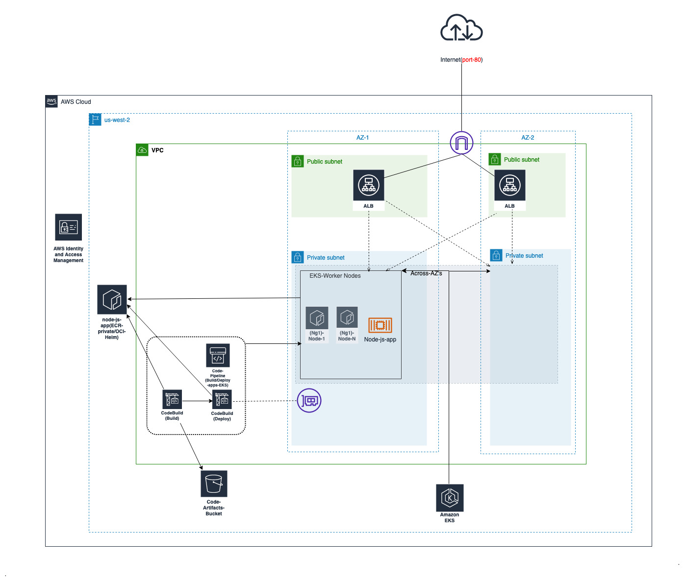

# Abstract

This code/repo deploys a standard VPC and EKS cluster with managed NodeGroup. Further, it will deploy a CICD pipeline for sample node-js application. This application is created via Docker process and uploaded to ECR and also a Helm package pushed to same ECR. At deploy stage of pipeline, the helm package is pulled to deploy the sample app in EKS.

### Architecture Diagram

### Steps to Deploy the code

#### Make sure you have required toolset to execute the deployment

- Linux system to execute the code, terraform, awscli, bash environment (linux platforms)

- Since the lab environment create resources that requires elevated acess, please authenticate your shell environmnet with AWS admin access.

- At any point, if you need to re-run, just rerun either step-1 below (or) "terraform init --reconfigure" as required, which will (re)initialize state file within already created file.)
- Clone the Repo and cd to repo root folder (Example:- `cd eks-lab/`)

#### Just in case check if startup.sh have execute permissions - chmod +x start.sh

1. `terraform init`

2. `terraform apply` (validate the plan and type `yes`) (This step takes 15 to 20 min to complete)

##### \* Note:- Since EKS deployment takes a while, if terraform apply failed/timeout, please rerun `terraform apply` again, which will re-apply and continue with any remaining creation of resources

### CICD

--Redesigning Repo in progress

#### Modules and References used

1. https://devopscube.com/create-helm-chart/ :- For understanding about Helm Charts
2. https://github.com/terraform-aws-modules/terraform-aws-eks - (For EKS, This code was lightly modified to fit ALB, SG)
3. https://tf-eks-workshop.workshop.aws/500_eks-terraform-workshop.html ( For CICD, This code was heavily modified and rearchitected to fit Docker, ECR, and Helm into the process)
